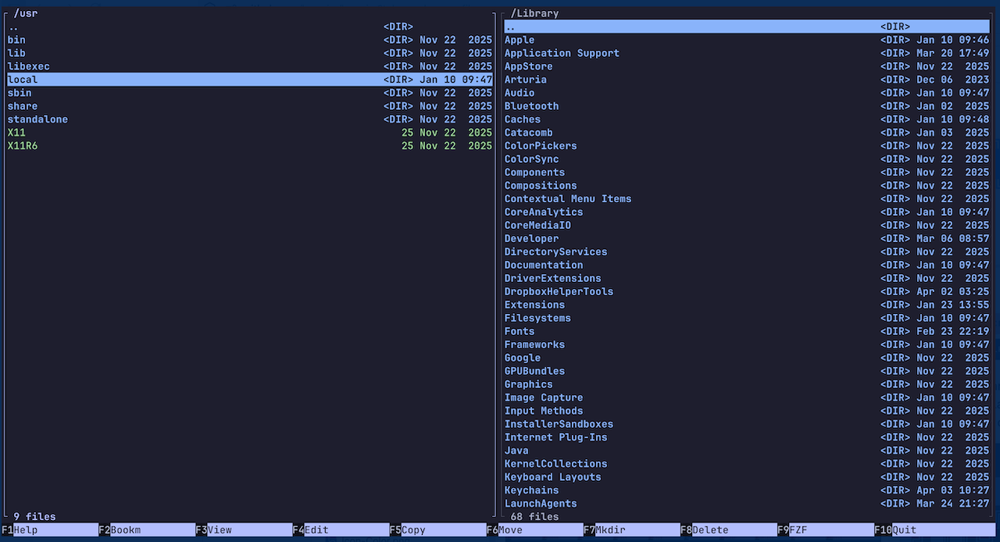
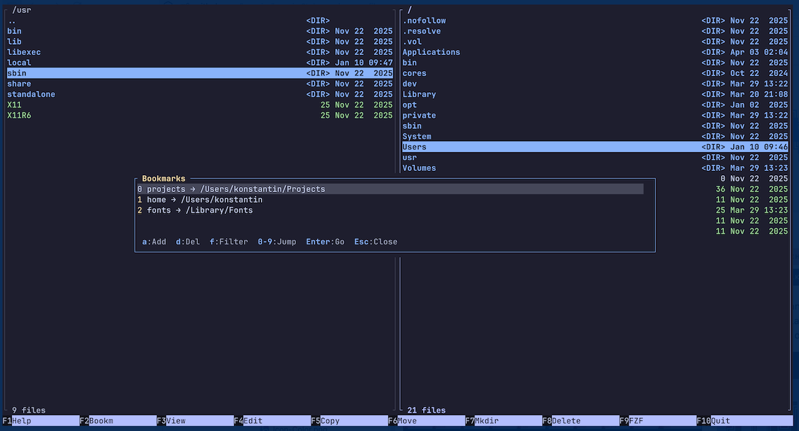
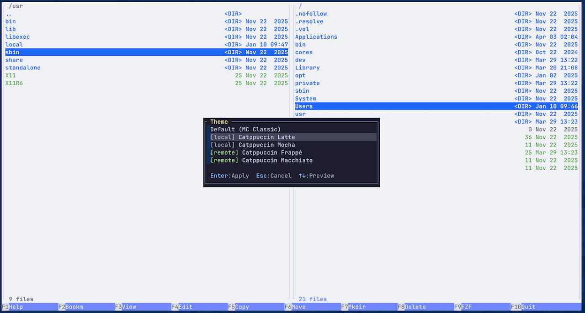
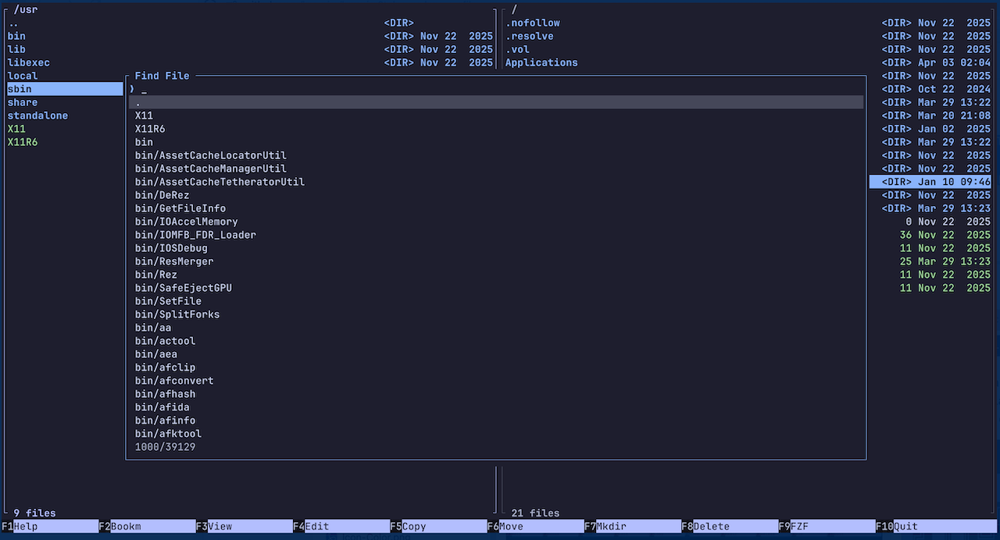

# Midday Commander

A modern dual-panel terminal file manager written in Go, inspired by Midnight Commander.

Midday Commander (mdc) brings the classic dual-panel file management paradigm into the modern terminal with fuzzy finding, bookmarks, archive browsing, themes and customizable keybindings.



**Bookmarks** — bookmarks for most visited locations


**Themes** — TOML-based themes with live preview


**Fuzzy Find**


## Features

- **Dual-panel file browsing** with independent navigation and selection
- **Archive browsing** - enter ZIP, TAR, 7z, RAR, GZ, BZ2, XZ, LZ4 files as virtual directories
- **Fuzzy finder** - recursive file search with real-time fuzzy matching
- **Bookmarks** to quickly jump to most visited locations
- **Configurable keybindings** - every key is remappable via `config.toml`
- **File operations** - copy, move, delete, rename, mkdir with confirmation dialogs
- **Live theme picker** - browse and preview themes with Ctrl-T
- **Multi-file selection** - tag files with Insert or Shift+Arrow for batch operations
- **Quick search** - start typing to jump to matching files instantly
- **External editor/viewer** - opens files in `$EDITOR` and `$PAGER`
- **Mouse support** - clickable menu bar and panel interaction
- **Go to path** - quickly jump to any directory with `~` expansion
- **Single binary** - no runtime dependencies

## Installation

### Using Homebrew

```bash
brew install kooler/apps/MiddayCommander
```

Run: `mdc`

### From releases (MacOS/Windows/Linux)
Download a binary from the [Releases](https://github.com/kooler/MiddayCommander/releases) in Github.

### Build from source

Requires Go 1.21 or later.

```bash
git clone https://github.com/kooler/MiddayCommander.git
cd mdc
make build
```

The binary will be at `./mdc`. Move it to your `$PATH`:

```bash
sudo mv mdc /usr/local/bin/
```

### Build targets

```bash
make build   # Build the binary
make run     # Build and run
make test    # Run tests
make vet     # Run go vet
make clean   # Remove binary
```

## Quick Start

```bash
mdc
```

The left panel opens in the current directory, the right panel in your home directory. Navigate with arrow keys or `j`/`k`, switch panels with `Tab`.

## Keybindings

### Global

| Key | Action |
|-----|--------|
| `F1` | Help - show keybinding reference |
| `F2` | Bookmarks |
| `F3` | View file (`$PAGER`) |
| `F4` | Edit file (`$EDITOR`) |
| `F5` | Copy to other panel |
| `F6` | Move to other panel |
| `F7` | Create directory |
| `F8` | Delete |
| `F9` | Fuzzy finder |
| `F10` | Quit |
| `Esc Esc` | Quit (double-press) |
| `Tab` | Switch active panel |
| `Ctrl-U` | Swap panels |
| `Ctrl-G` | Go to path |
| `Ctrl-P` | Fuzzy finder |
| `Ctrl-B` | Bookmarks |
| `Ctrl-T` | Theme picker (live preview) |

### Navigation

| Key | Action |
|-----|--------|
| `Up` / `k` | Move cursor up |
| `Down` / `j` | Move cursor down |
| `PgUp` / `PgDn` | Page up / down |
| `Home` / `End` | Jump to first / last |
| `Enter` | Enter directory or edit file |
| `Space` | Preview file (`$PAGER`) |
| `Backspace` | Go to parent directory |
| Type any letter | Quick search - jump to matching file |

### Selection

| Key | Action |
|-----|--------|
| `Insert` | Toggle selection on current file |
| `Shift-Up` | Select and move up |
| `Shift-Down` | Select and move down |
| `Insert` | Toggle selection and move down |

### Bookmarks

| Key | Action |
|-----|--------|
| `a` | Add current directory |
| `d` | Delete selected bookmark |
| `f` | Filter bookmarks |
| `0`-`9` | Quick jump to bookmark |
| `Enter` | Navigate to bookmark |
| `Esc` | Close |

### Archives

Press `Enter` on any supported archive file to browse its contents as a virtual directory. `Backspace` exits the archive.

Supported formats: `.tar`, `.tar.gz`, `.tar.bz2`, `.tar.xz`, `.zip`, `.7z`, `.rar`, `.gz`, `.bz2`, `.xz`, `.lz4`, `.lz`, `.zst`

## Configuration

Configuration lives at `~/.config/mdc/config.toml` (respects `XDG_CONFIG_HOME`).

Copy the example to get started:

```bash
mkdir -p ~/.config/mdc
cp config.example.toml ~/.config/mdc/config.toml
```

### Example config

```toml
# Theme (loads from ~/.config/mdc/themes/<name>.toml)
theme = "catppuccin-mocha"

[behavior]
# What Enter does on a file: "edit" or "preview"
enter_action = "edit"
# What Space does on a file: "preview" or "edit"
space_action = "preview"

[keys]
quit          = ["f10", "ctrl+c"]
toggle_panel  = "tab"
copy          = "f5"
move          = "f6"
mkdir         = "f7"
delete        = "f8"
fuzzy_find    = ["f9", "ctrl+p"]
bookmarks     = ["f2", "ctrl+b"]
help          = "f1"
goto          = "ctrl+g"
# ... all keys are configurable
```

See [`config.example.toml`](config.example.toml) for the full reference.

## Themes

Themes are TOML files stored at `~/.config/mdc/themes/`.

### Live theme picker

Press `Ctrl-T` to open the theme picker overlay. Use `Up`/`Down` to browse themes with live preview — the entire UI updates instantly as you navigate. Press `Enter` to apply the selected theme or `Esc` to cancel and revert to the previous theme.

### Installing themes

```bash
mkdir -p ~/.config/mdc/themes
cp themes/*.toml ~/.config/mdc/themes/
```

### Theme format

Themes use a `[palette]` section to define named colors, then reference them throughout:

```toml
name = "My Theme"

[palette]
bg     = "#1e1e2e"
fg     = "#cdd6f4"
blue   = "#89b4fa"
green  = "#a6e3a1"

[panel]
border_fg        = "blue"
border_bg        = "bg"
border_active_fg = "fg"
border_active_bg = "bg"

[panel.file]
normal_fg  = "fg"
normal_bg  = "bg"
dir_fg     = "blue"
dir_bold   = true
exec_fg    = "green"

[statusbar]
fg = "bg"
bg = "blue"

[menubar]
fg           = "bg"
bg           = "blue"
fkey_hint_fg = "fg"
fkey_hint_bg = "bg"
fkey_label_fg = "bg"
fkey_label_bg = "blue"
```

Colors can be hex values (`"#89b4fa"`), ANSI color numbers (`"4"`), or palette references (`"blue"`). Any missing values fall back to the built-in default theme.

## Contributing

Contributions are welcome. Please open an issue to discuss significant changes before submitting a pull request.

1. Fork the repository
2. Create your feature branch (`git checkout -b feature/my-feature`)
3. Commit your changes (`git commit -am 'Add my feature'`)
4. Push to the branch (`git push origin feature/my-feature`)
5. Open a Pull Request

### Development

```bash
git clone https://github.com/kooler/MiddayCommander.git
cd mdc
make build
make test
```

## License

MIT License. See [LICENSE](LICENSE) for details.
